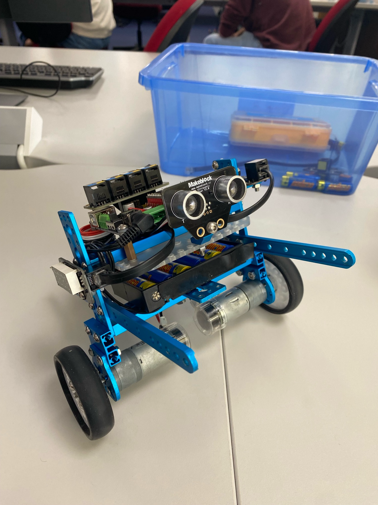

# MINHO: Self-Balancing Robot

## Overview
This project documents the design, development, and control of **MINHO**, a compact self-balancing robot created for ENGMT380. The robot demonstrates autonomous balancing, obstacle avoidance, and maze navigation through the use of gyroscope and ultrasonic sensors, PID control, and dynamic motor actuation.

## Robot Design


## Key Features
- Self-balancing via gyroscopic feedback and PID control
- Obstacle avoidance using ultrasonic sensors
- Maze navigation through predefined turning logic and orientation correction
- Compact, energy-efficient, and mechanically stable design

## Hardware Specifications

| Component      | Details |
|----------------|---------|
| **Controller** | Makeblock MegaPi with ATmega2560 |
| **Motors**     | Makeblock DC Motors with Encoders (1.2 Nm torque) |
| **Sensors**    | Me 3-Axis Gyro Sensor, Me Ultrasonic Sensor |
| **Display**    | Me 7-Segment Display |
| **Power**      | 6–12 V DC, 2–5 A total draw |
| **Communication** | UART, I2C, SPI, USB 2.0, optional Bluetooth/Wi-Fi |

## Tasks Implemented

### 🌀 Task 1: Balance
- Implemented PID control using gyro Y-axis angle.
- Tuned PID gains to maintain upright position.
- Limited integral windup and current draw.

### 🚧 Task 2: Obstacle Avoidance
- Tilt angle shifted forward to induce motion.
- Ultrasonic sensor used to detect walls within 25 cm.
- Turns implemented via differential PWM.
- Sampling delay added to prevent overcurrent faults.

### 🧭 Task 3: Maze Navigation
- Used ultrasonic sensor and Z-axis angle for path correction.
- Predefined Z-angle array allowed approximate directional compensation.
- Adaptive turn logic using gyro and encoder feedback.

## Limitations
- Navigation success is sensitive to **initial orientation** due to predefined Z-angle path logic.
- **Gyro drift** over time affects long-run accuracy.
- The rear-mounted **claw** introduces unintended backwards drift during transitions.

## Future Improvements
- Implement **dynamic feedback for Z-angle** using side-facing sensors.
- Periodic **gyro recalibration** using known wall distances.
- Redesign claw to reduce interference with turning.

## Repository Structure
```
self_balancing_robot-main/
    self_balancing_robot-main/
        README.md
        Report - Lab 1.pdf
        maze_running/
            maze_running.ino
        pid_control/
            pid_control.ino
```

## References
- ScienceABC. (2023). *Why tightrope walkers carry a pole*. [Link](https://www.scienceabc.com/eyeopeners/why-tightrope-walkers-carry-a-polebar-during-their-performance.html)
- Ding, Y. et al. (2012). *Modeling, Simulation and Fabrication of a Balancing Robot*. [Harvard Report](https://scholar.harvard.edu/files/jgafford/files/finalpaper_final_version.pdf)
